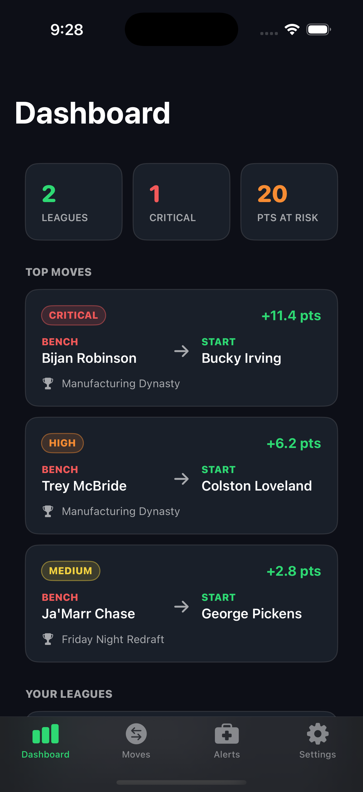
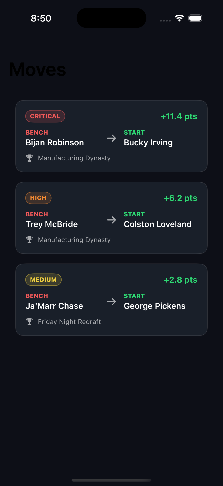
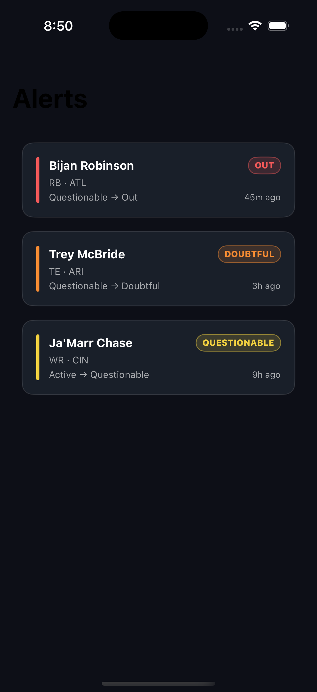
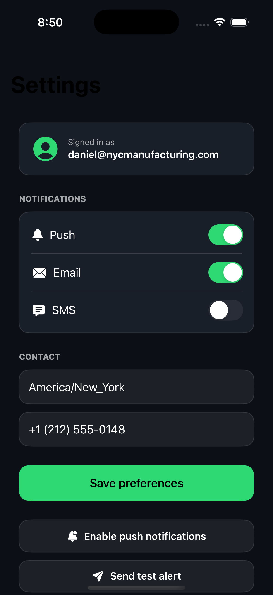
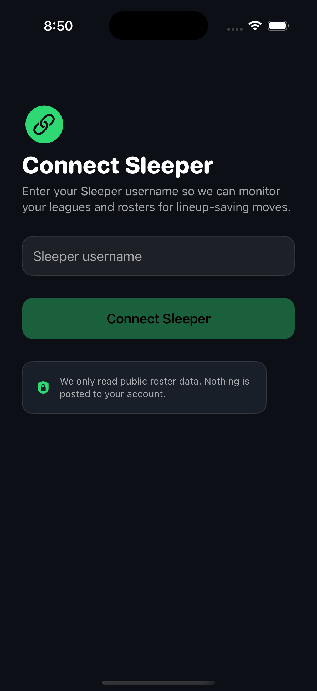
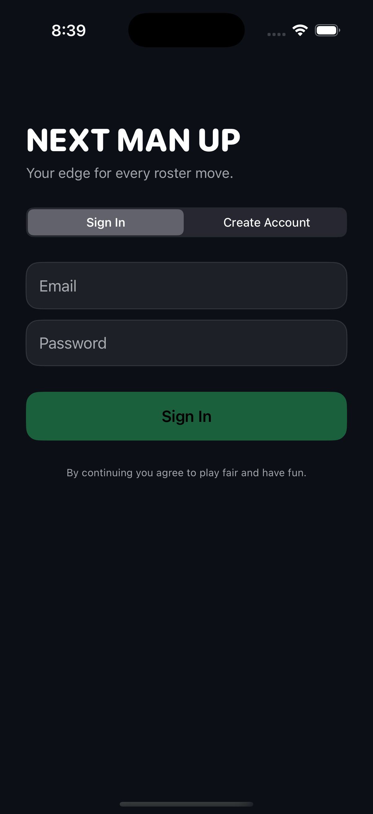

<div align="center">

# 🏈 Next Man Up

### Real-time fantasy-football injury alerts that tell you the *exact* roster move to make.

A starter goes down 90 minutes before kickoff. You don't need another notification telling you he's hurt — you need to know **what to do about it**. Next Man Up watches your Sleeper roster, catches the injury, and surfaces the single best move: who to start, who to pick up, who to drop, what to stash on IR — each with a projected point delta.

<br/>

[](https://next-man-up.vercel.app)

<br/>

[](https://nextjs.org)
[](https://react.dev)
[](https://www.typescriptlang.org)
[](https://tailwindcss.com)
[](https://developer.apple.com/swift/)
[](https://supabase.com)
[](https://vercel.com)

<br/>



<sub><i>The dashboard — your roster, your risks, your next move, at a glance.</i></sub>

</div>

<br/>

---

## What it does

Most apps tell you *that* a player is hurt. By the time you've cross-referenced your bench, checked slot eligibility, and scanned the waiver wire, the window has closed. Next Man Up collapses that whole loop into one line: **here is the move, and here's how many points it's worth.** It detects, recommends, and explains — it never makes moves in Sleeper for you.

|  |  |
|---|---|
| 🔔 **Injury alerts** | A live feed of injury and status events that actually touch *your* roster — not the league-wide firehose. |
| 🔁 **Start / Sit** | Concrete swaps with projected **point deltas**, so you know exactly what the move is worth. |
| ➕ **Waiver pickups** | When your bench can't cover the gap, it surfaces the best available replacement. |
| ➖ **Drops & 🏥 Move-to-IR** | Recovers roster spots and frees an IR slot when a player qualifies. |
| ⚙️ **Channels + quiet hours** | Per-channel delivery preferences and quiet-hours gating, so 3 a.m. waiver news waits until morning. |

---

## Screenshots

<table>
  <tr>
    <td align="center"><br/><sub><b>Dashboard</b></sub></td>
    <td align="center"><br/><sub><b>Moves</b> · start/sit + point deltas</sub></td>
    <td align="center"><br/><sub><b>Alerts</b> · injury feed</sub></td>
  </tr>
  <tr>
    <td align="center"><br/><sub><b>Settings</b> · channels + quiet hours</sub></td>
    <td align="center"><br/><sub><b>Onboarding</b> · connect Sleeper</sub></td>
    <td align="center"><br/><sub><b>Auth</b></sub></td>
  </tr>
</table>

---

## Status — honest & current

A transparent split of what's **live** versus what's **built but waiting** on production keys and a live NFL season (it's the offseason as of this writing).

| Capability | State | Notes |
|---|:---:|---|
| Web app — Next.js, all routes | ✅ **Live** | Deployed in production on [Vercel](https://next-man-up.vercel.app); all routes compile and serve. |
| Native iOS app — Swift / SwiftUI | ✅ **Real · runs on Simulator** | Auth, onboarding, tabbed Dashboard / Moves / Alerts / Settings, recommendation detail, APNs registration, Keychain sessions. Builds clean. *(Not on the App Store / TestFlight.)* |
| Recommendation engine | ✅ **Built + tested** | Value scoring, slot eligibility, start/sit + waiver + drop + move-to-IR. **51-test** unit suite passing. |
| Supabase backend | ✅ **Live** | Postgres + Auth + Row-Level Security across **13 tables**. |
| Pipeline schedule — cron → endpoint | ✅ **Verified end-to-end** | pg_cron + pg_net drive sync → detect → recommend → deliver; the schedule-triggers-endpoint path is verified (Postgres → guarded endpoint → 200). |
| Web Push (VAPID) delivery | 🟡 **Live channel · no live sends** | Channel implemented and live; no real injury events to deliver yet (offseason). |
| APNs / Email / SMS delivery | 🟡 **Implemented · pending** | Queue, fan-out, and preference-gating built; the drain-cron runs. **Zero messages delivered end-to-end** — needs production API keys + a live season. |
| Live recommendations in production | 🟡 **Pending season** | The engine is built and tested; none generated in production yet (NFL offseason). |

> **In plain terms:** the *machinery* is real and wired together — auth, schema, RLS, the engine, the scheduled pipeline, two clients. What's pending is **live-season delivery at scale**, which is gated on the calendar and on production messaging keys, not on missing code.

---

## Architecture

```
Sleeper API
     │  sync
     ▼
┌────────────────────────────────────────────────────────────┐
│  Supabase — Postgres + Auth + RLS  (13 tables)              │
│  players · rosters · snapshots · news_events ·              │
│  recommendations · alerts · device_tokens · prefs · …       │
└────────────────────────────────────────────────────────────┘
     │  pg_cron + pg_net drive the pipeline every 5–15m
     ▼
   sync  ──▶  detect  ──▶  recommend  ──▶  deliver
                                              │
                                              ▼
                                   Web Push · APNs · Email · SMS

        web (Next.js)  ◀──  RLS reads  ──▶  iOS (SwiftUI)
```

- **Cron drives everything.** pg_cron schedules the pipeline; pg_net calls guarded Next.js endpoints. The service role is used *only* by cron — never by the clients.
- **Clients read through RLS.** The web app and the iOS app each read their own data through Row-Level Security. No client ever holds elevated privileges.
- **The engine is pure and testable.** Scoring, slot eligibility, and action selection are isolated from I/O — which is why a 51-test suite can cover them deterministically.

---

## Tech stack

| Layer | Tools |
|---|---|
| **Web** | Next.js 16 (App Router) · React 19 · TypeScript (strict) · Tailwind v4 · shadcn/ui |
| **iOS** | Swift · SwiftUI · Keychain · APNs |
| **Backend** | Supabase — Postgres · Auth · RLS · pg_cron · pg_net |
| **Data & delivery** | Sleeper public API · Web Push (VAPID) · Resend · Twilio |
| **Infra** | Vercel |

---

## Source

The full source — the Next.js web app, the native SwiftUI client, and the Supabase backend (schema, RLS, recommendation engine, and the scheduled pipeline) — lives in a **private repository**. Happy to walk through the architecture or code on request.

---

<div align="center">

Built by **Daniel Tzaka**.

<sub>Sleeper is a trademark of Blitz Studios, Inc. Next Man Up is an independent project and is not affiliated with or endorsed by Sleeper.</sub>

</div>
